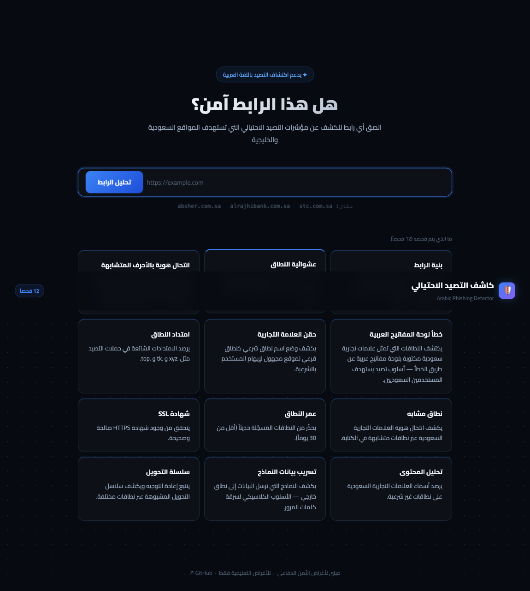
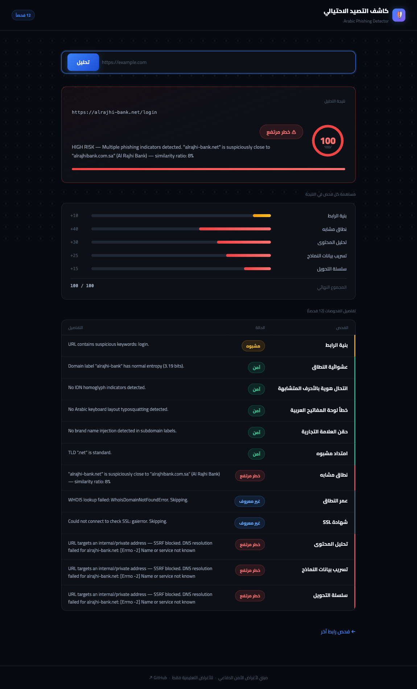
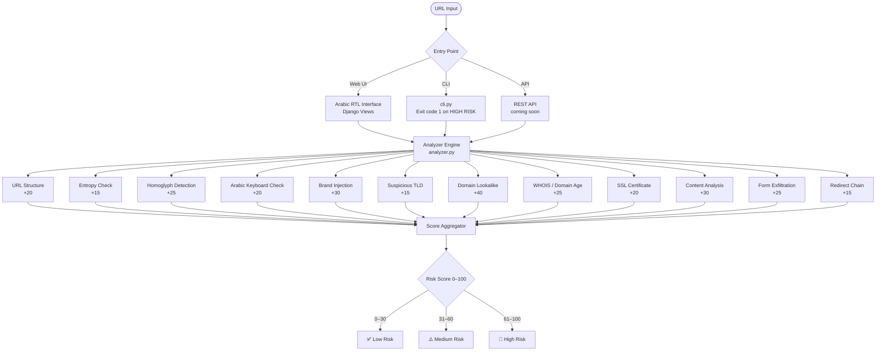

# Arabic Phishing Detector — كاشف مواقع التصيد الاحتيالي


**🌐 Live Demo: [web-production-543fcd.up.railway.app](https://web-production-543fcd.up.railway.app)**

A phishing URL detection tool built specifically for **Saudi and Gulf brand impersonation** — the attack surface that generic tools like VirusTotal and PhishTank underserve.

Available as a **live web application** (Arabic RTL interface), a **command-line tool**, and a **REST API** (coming soon).

---

## Why I Built This

During my time studying offensive security and SOC operations, I kept noticing the same gap: when I ran Saudi phishing URLs through standard tools — VirusTotal, PhishTank, URLVoid — they came back clean. Not because the URLs were safe, but because those platforms are built around English-speaking brand targets.

Saudi banks, telecom providers like STC and Mobily, and government portals like Absher are impersonated constantly. The attacks are sophisticated — typosquatted `.net` domains that look like `.com.sa`, Arabic keyboard layout mistakes turned into phishing URLs, brand names injected as subdomains. None of that registers on generic scanners.

So I built one that does. No black-box ML, no API keys, no community blacklists — just deterministic, explainable checks tuned specifically to the Saudi and Gulf attack surface. Every flag it raises tells you exactly why.

---

## Live Demo

<table>
<tr>
<td width="50%" align="center">
  <b>Homepage — Arabic RTL Interface</b><br><br>
  
</td>
<td width="50%" align="center">
  <b>Scan Result — 100/100 HIGH RISK</b><br><br>
  
</td>
</tr>
</table>

Try it now — no install needed: **[https://web-production-543fcd.up.railway.app](https://web-production-543fcd.up.railway.app)**

---

## Architecture



---

## Detection Checks (12 total)

| Check | What It Detects | Max Score |
|-------|----------------|-----------|
| URL Structure | Raw IP as hostname, excessive subdomains, suspicious path keywords | +20 |
| Entropy | Auto-generated high-entropy domains (common in phishing infrastructure) | +15 |
| Homoglyph | Punycode domains using Unicode lookalikes to spoof brand names | +25 |
| Arabic Keyboard | Saudi brand names typed with Arabic keyboard layout by mistake | +20 |
| Brand Injection | Brand name placed as subdomain of unknown domain to fake legitimacy | +30 |
| Suspicious TLD | Abused TLDs: `.xyz`, `.tk`, `.top`, `.click` and others | +15 |
| Domain Lookalike | Typosquatting against Saudi brand domains (ratio + prefix matching) | +40 |
| Domain Age | Domains registered less than 30 days ago | +25 |
| SSL Certificate | Missing or invalid HTTPS certificate | +20 |
| Content Analysis | Saudi brand names on a domain that isn't the real brand | +30 |
| Form Exfiltration | Forms that submit data to an external domain | +25 |
| Redirect Chain | Suspicious cross-domain redirect chains | +15 |

**Risk levels:** 0–30 = Low &nbsp;·&nbsp; 31–60 = Medium &nbsp;·&nbsp; 61–100 = High

---

## Supported Brands

**Telecom:** STC, Mobily, Zain

**Banking:** Al Rajhi Bank, SNB, Samba, Riyad Bank, Alinma, Arab National Bank, Bank AlJazira, Saudi Fransi

**Government:** Absher, Nafath, Ministry of Interior, Ministry of Labor, Saudi Post, SADAD, Tawakkalna

**E-Commerce:** Noon, Jarir, Extra, stc pay

Want to add more brands? See [CONTRIBUTING.md](CONTRIBUTING.md).

---

## Run Locally

```bash
git clone https://github.com/iivqs/arabic-phishing-detector.git
cd arabic-phishing-detector
pip install -r requirements.txt
cp .env.example .env
python manage.py migrate
python manage.py runserver
```

Open **http://127.0.0.1:8000**

---

## Command Line

```bash
python cli.py https://suspicious-site.com

# JSON output (for scripting / piping into other tools)
python cli.py https://suspicious-site.com --json
```

Exits with code `1` if the URL is **High Risk**.

### Example Output

```
[*] Analyzing: https://alrajhi-bank.net/login

  [URL Structure]           PASS         URL structure looks normal.
  [Suspicious TLD]          CAUTION      TLD ".net" is unusual for Saudi financial services.
  [Domain Lookalike]        HIGH RISK    "alrajhi-bank.net" is close to "alrajhibank.com.sa" — ratio: 8%
  [Domain Age]              HIGH RISK    Domain registered 3 days ago.
  [SSL Certificate]         PASS         Valid SSL certificate found.
  [Content Analysis]        HIGH RISK    Page references "Al Rajhi Bank" but domain doesn't match.
  [Redirect Chain]          PASS         No redirects.

  Risk Score : 95/100  [###################-]
  Risk Level : HIGH
```

---

## Deploy Your Own

The project is ready to deploy on [Railway](https://railway.app) in one click:

1. Fork this repo
2. Create a new project on Railway → Deploy from GitHub
3. Set these environment variables:

| Variable | Value |
|----------|-------|
| `DJANGO_SECRET_KEY` | `python -c "import secrets; print(secrets.token_urlsafe(50))"` |
| `DJANGO_DEBUG` | `false` |
| `DJANGO_ALLOWED_HOSTS` | your Railway domain |

Railway runs `python manage.py migrate` and starts `gunicorn` automatically.

---

## Running Tests

```bash
python -m pytest tests/ -v
```

---

## Logging

All scans are written to `logs/app.log` with daily rotation (30 days kept).

```bash
tail -f logs/app.log              # watch live
grep "HIGH RISK" logs/app.log     # dangerous URLs only
grep "ERROR" logs/app.log         # errors only
```

---

## Project Structure

```
arabic-phishing-detector/
├── cli.py                     # Command-line entry point
├── manage.py                  # Django management
├── Procfile                   # Railway/Heroku start command
├── railway.toml               # Railway deploy config
├── requirements.txt
├── .env.example               # Environment variable template
├── docs/                      # Screenshots and assets
├── detector/
│   ├── analyzer.py            # Orchestrates all checks
│   ├── brands.py              # Saudi/Gulf brand list (community-expandable)
│   └── checks/                # One file per detection check (12 checks)
├── web/                       # Django app — Arabic RTL interface
├── phishing_site/             # Django project settings
├── logs/                      # Rotating log files (gitignored)
└── tests/
    └── test_analyzer.py       # 11 tests
```

---

## Roadmap

- [ ] Stage 3: REST API (`POST /api/analyze`) with rate limiting
- [ ] VirusTotal integration (optional API key)
- [ ] More Gulf/MENA brands (UAE, Kuwait, Bahrain)
- [ ] Docker support

---

## License

MIT — see [LICENSE](LICENSE).

---

*Built for defensive security and educational purposes.*
